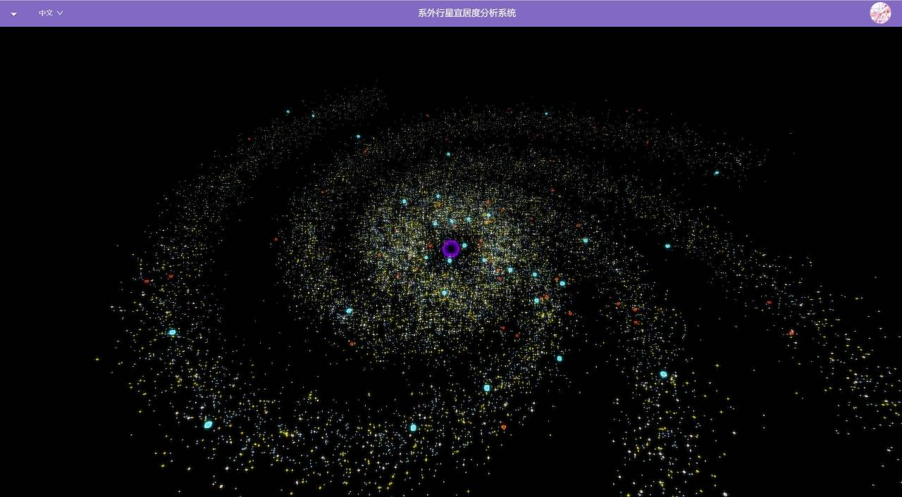
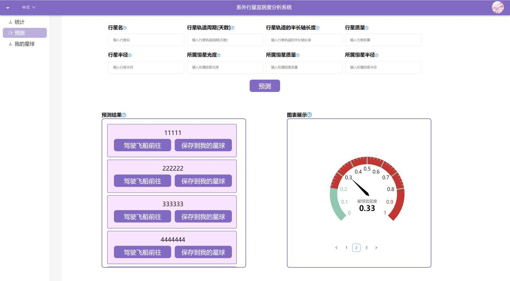
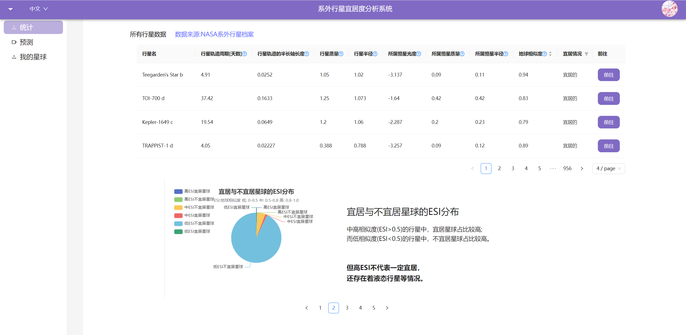

# 2023-BJTU-Summer-Project
BJTU 2023软件工程实训 系外行星宜居度分析系统

# 系外行星宜居度分析系统

> BJTU 2023软件工程实训
>
> 小组：蓝色空间 Blue Space
>
> 口号："蓝色空间，前进四！"

## 1. 预览

* 系统登录页面
  * 
* 星图 - 银河系视图
  * 
  * 
* 星图 - 行星视图
  * 
* 预测系统
  * 
* 新用户指引
  * 
* 统计页面
  * 

## 2. 简介

### 2.1 课题

- 系外行星宜居度分析系统

### 2.2 项目背景

- 交通，不止地面交通，还有天空交通，更有星际交通！

- 交通的基础便是一个个站点，而在星际中要搭建星球站点，肯定就要对星球进行宜居度分析

- 所以我们的选题是 **系外行星宜居度分析系统**

### 2.3 项目目标

- 我们会搭建一系列模型，输入一颗系外行星的相关数据，输出这个行星的宜居度和地球相似度(ESI)等数值

- 对系外行星数据进行其他相关的分析

### 2.4 项目意义

- ~~非常有趣~~

- 分析星球宜居度，为进一步的研究提供基础

- 分析星球宜居度，为未来人类可能的星际交通搭建提供参考
  - 比如在文化作品创作中

### 2.5 数据集

- 使用NASA开普勒系外行星数据集，有近10k条数据
  - [Kaggle](www.kaggle.com/datasets/nasa/kepler-exoplanet-search-results)
  - [NASA](https://exoplanetarchive.ipac.caltech.edu/cgi-bin/TblView/nph-tblView?app=ExoTbls&config=PS)

## 3. 技术路线

- 前端：React
  - 前端构建工具：Vite
  - 图形库：WebGPU
  - 前端规范：[Google TypeScript 规范](https://zh-google-styleguide.readthedocs.io/en/latest/google-typescript-styleguide/syntax/#section-3)
  
- 后端：Django
  - 数据库管理：PyMySQL、Django-import-export、cyptography
  - 大语言模型：MinecraftLLMSupportBackend

- 数据库：MySQL

## 4. 计划

- 7.3答辩PPT制作

- 数据集下载及分析

- 论文分析
  - [The habitable exoplanets catalog](https://phl.upr.edu/projects/habitable-exoplanets-catalog)
  - [On the habitability of extra-solar planets](http://115.27.245.27/_tsf/00/0E/EJvQn2qeyqq2.pdf)

- 需求分析与明确

- 项目框架搭建
  - 前端
  - 后端
  - 数据库
  - 数据分析

- 编码

- 数据分析

- etc

## 5. 小组分工

- 项目经理：俞贤皓

- 服务端工程师：谷雅丰、王艺霖

- 客户端工程师：邓人嘉、周书扬

- 数据处理工程师：付家齐
