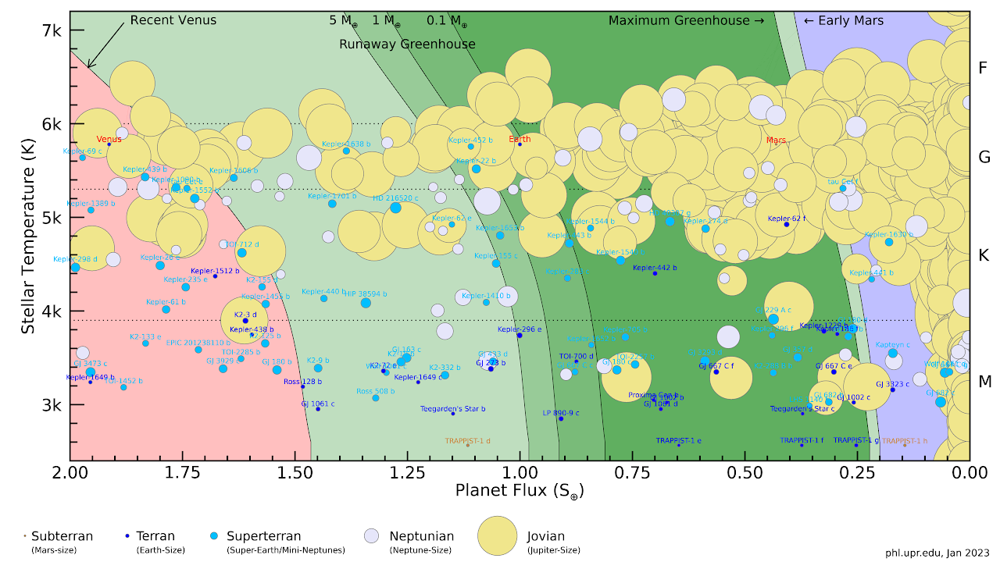
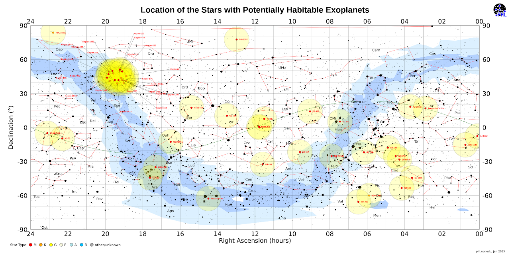
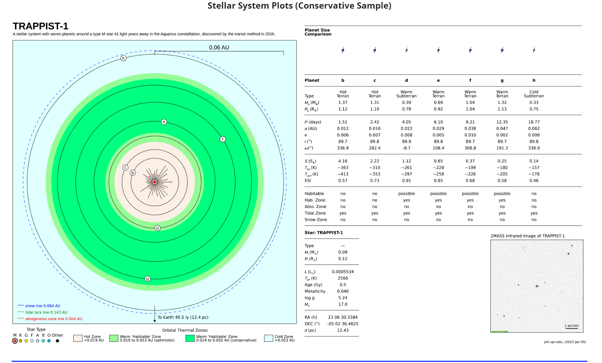

# 1. THE HABITABLE EXOPLANETS

## 1.1 简介

这篇论文是关于《宜居系外行星目录》的数据库，收录了过去十年里由地面和空间望远镜发现的可能具有宜居性的世界。这些系外行星的数据来自NASA的系外行星档案，包括在乐观的恒星宜居区内，半径最大为2.5地球半径或质量最大为10地球质量的行星。而保守的样本则包括那些更可能是岩石构成，半径最大为1.6地球半径或质量最大为3地球质量的行星。

## 1.2 目前发现的可宜居星球

- 亚地球：1个（火星大小，0.1 — 0.5地球质量或0.4 — 0.8地球半径）
- 地球：23个（地球大小，0.5 — 3地球质量或0.8 — 1.6地球半径）
- 超地球：39个（超地球/迷你海王星大小，3 — 10地球质量或1.6 — 2.5地球半径）
- 总计：63个

### 1.2.1 可宜居星球的分类

- 保守的可能宜居行星样本：这是一份更可能具有岩石构成和支持表面液态水的行星列表，即行星半径在0.5至1.6地球半径之间，或行星最小质量在0.1至3地球质量之间。
- 乐观的可能宜居行星样本：这是一份较不可能具有岩石构成或维持表面液态水的行星列表，即行星半径在1.6至2.5地球半径之间，或行星最小质量在3至10地球质量之间。其中一些行星可能最终被证明是海洋世界或迷你海王星。

## 1.3 宜居区图

展示了所有靠近宜居区的行星（深绿色区域是保守的宜居区，浅绿色区域是乐观的宜居区）。

## 1.4 夜空位置图

显示了所有已知可能存在宜居世界的恒星系统的在地球视角的夜空位置。

## 1.5 保守可宜居星球的模型

显示了目前发现的保守可宜居星球的建模，下以TRAPPIST-1星系为例。

# 2. On the habitability of extra-solar planets 关于太阳系外行星的宜居性

## 2.1 简介

确定一颗太阳系外行星是否是宜居的，其首要条件是该行星的表面温度是否能够保证液态水的长期存在。本文将简要介绍位于红矮星宜居带内的行星的宜居性研究进展。由于潮汐锁相作用，该类行星的一面永远面对恒星，较为温暖，而另一 面永远背对恒星，极端寒冷。极低的温度有可能导致大气成分和水分完全冻结在背阳面，并导致行星不适宜生命存在。本文将讨论大气和海洋环流能否输送足够多的热量到背阳面，并加热背阳面，从而避免大气和水分的完全冻结。

## 2.2 内容

论文的主要内容包括：

1. 讨论了潮汐锁相行星的大气和海洋环流对其气候特征的影响。研究表明，大气与海洋热量输送足以把潮汐锁相行星的背阳面加热到类似地球大气各主要成分的凝固点之上，亦即潮汐锁相行星不会产生大气坍塌的现象。
2. 讨论了水分是否会完全冻结在潮汐锁相行星的背阳面的问题。考虑到冰川自背阳面向朝阳面的移动极为缓慢，远低于自朝阳面向背阳面输送水汽的速度，因此，一个可能的情形是朝阳面的液态水在完全蒸发并在背阳面沉降之后，而冰川推进和融化也仅存在于朝阳面和背阳面的交界处而无法推进到朝阳面，最后导致液态水全部冻结在背阳面。如果水分完全冻结在背阳面，即使朝阳面的温度在 0 °C 之上，因为朝阳面没有液态水，行星也是不适宜生命存在的。